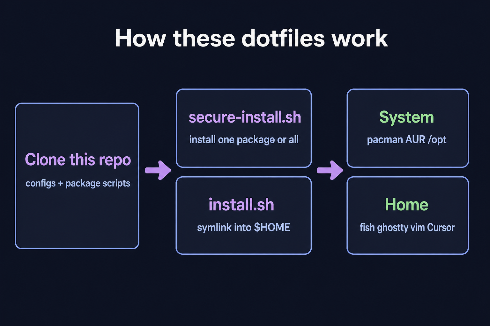

# Dotfiles

Public Fish, Ghostty, Vim, and Cursor setup for a Linux desktop.



## Install

```bash
git clone https://github.com/yelenkovsky/dotfiles.git ~/dotfiles
cd ~/dotfiles
chmod +x install.sh secure-install.sh setup/*.sh
./secure-install.sh --yes   # all packages
./secure-install.sh --list  # named targets (remnote, desktop, aur, …)
./secure-install.sh remnote # one vendor app; groups work the same way
./secure-install.sh audiorelay # stream audio between phone and PC
./install.sh                # symlink configs into $HOME
```

`install.sh` resolves paths from its own directory, so the clone does not have to live at `~/dotfiles`. Vendor apps and pacman/AUR groups live in `secure-install/packages/`; `./secure-install.sh --help` shows `--only` / `--skip`.

## What is linked

| Path | Role |
| --- | --- |
| `.vimrc` | Vim |
| `.gitconfig` | Git identity and `gh` credential helper |
| `.config/fish`, `.config/omf` | Fish + Oh My Fish |
| `.config/starship.toml` | Prompt |
| `.config/ghostty` | Terminal |
| `.config/eza` | `ls` replacement theme |
| `.config/gh/config.yml` | GitHub CLI (no `hosts.yml`) |
| `.config/Cursor/` | Editor settings, keybindings, snippets |
| `.cursor/skills/add-secure-install-app` | Cursor skill for adding apps to `secure-install/packages/` |

## Extra setup

- `setup/setup-wireshark.sh` — capture group permissions (does not install Wireshark)

## Updating

These files are the copies that `$HOME` should symlink to. Edit them here (or via the home symlink), then commit in this repository.

## License

[MIT](LICENSE)
