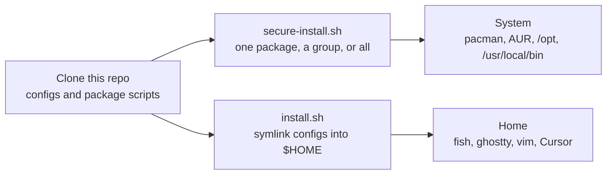

# Dotfiles

Public Fish, Ghostty, Vim, and Cursor setup for a Linux desktop. Package installs and home-directory symlinks are separate scripts.


```mermaid
flowchart LR
  clone["Clone this repo<br/>configs and package scripts"]
  secure["secure-install.sh<br/>one package, a group, or all"]
  link["install.sh<br/>symlink configs into $HOME"]
  system["System<br/>pacman, AUR, /opt, /usr/local/bin"]
  home["Home<br/>fish, ghostty, vim, Cursor"]

  clone --> secure --> system
  clone --> link --> home
```

## Install

```bash
git clone https://github.com/yelenkovsky/dotfiles.git ~/dotfiles
cd ~/dotfiles
chmod +x install.sh secure-install.sh setup/*.sh
./secure-install.sh --yes   # all packages
./secure-install.sh --list  # named targets (remnote, desktop, aur, …)
./secure-install.sh remnote # one vendor app; groups work the same way
./secure-install.sh audiorelay
./install.sh                # symlink configs into $HOME
```

`install.sh` resolves paths from its own directory, so the clone does not have to live at `~/dotfiles`. It replaces an existing symlink, and moves a real file aside into `~/dotfiles-backup-<timestamp>/`.

`secure-install.sh` loads every `secure-install/packages/*.sh`. Each script registers itself. Package groups (`core`, `desktop`, `util`, `fonts`, `gaming`, `aur`) install through pacman or yay. Gaming also installs `nvidia-prime`, the AUR package `mangojuice`, and the Proton-CachyOS Steam Linux Runtime x86-64-v3 build. Vendor apps download an artifact, check it, then install under `/opt` or `/usr/local/bin`. `./secure-install.sh --help` shows `--only`, `--skip`, and `--dry-run`. Logs go to `~/.local/state/dotfiles-installer/`.

## What is linked

| Path | Role |
| --- | --- |
| `.vimrc` | Vim |
| `.gitconfig` | Git identity and `gh` credential helper |
| `.config/fish`, `.config/omf` | Fish + Oh My Fish |
| `.config/starship.toml` | Prompt |
| `.config/ghostty` | Terminal |
| `.config/eza` | `ls` replacement theme |
| `.config/gh/config.yml` | GitHub CLI settings. Account credentials stay in a local `hosts.yml` |
| `.config/Cursor/` | Editor settings, keybindings, snippets |
| `.cursor/skills/add-secure-install-app` | Cursor skill for adding apps to `secure-install/packages/` (also linked at `~/.agents/skills/add-secure-install-app`) |

Yazi config, Omarchy theme hooks, and `plasma-themes/` stay in the clone. Link those paths yourself when you want them in `$HOME`.

## Extra setup

Run these by hand when you need them.

- `setup/setup-wireshark.sh` — capture group permissions. Install Wireshark separately
- `setup/usb.sh` — format a removable drive as one FAT32 partition and mount it at `/mnt/usb`
- `setup/usb-remount.sh` — remount that drive with user write permissions

## Updating

These files are the copies that `$HOME` should symlink to. Edit them here (or via the home symlink), then commit in this repository.

## License

[MIT](LICENSE)
